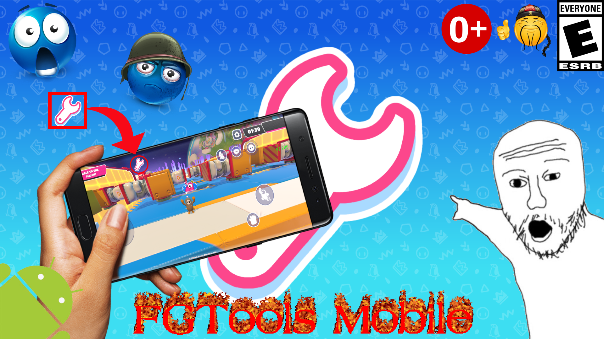
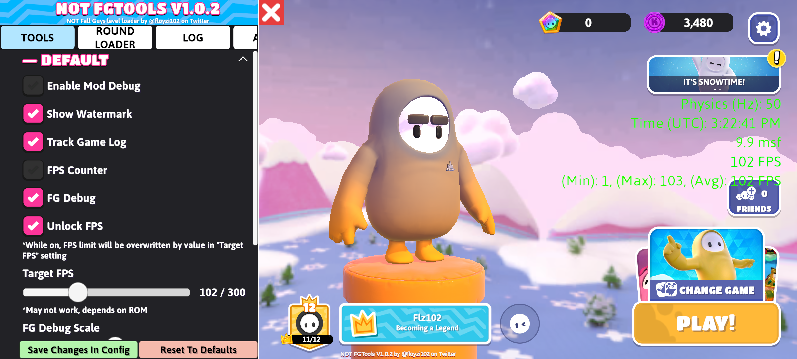
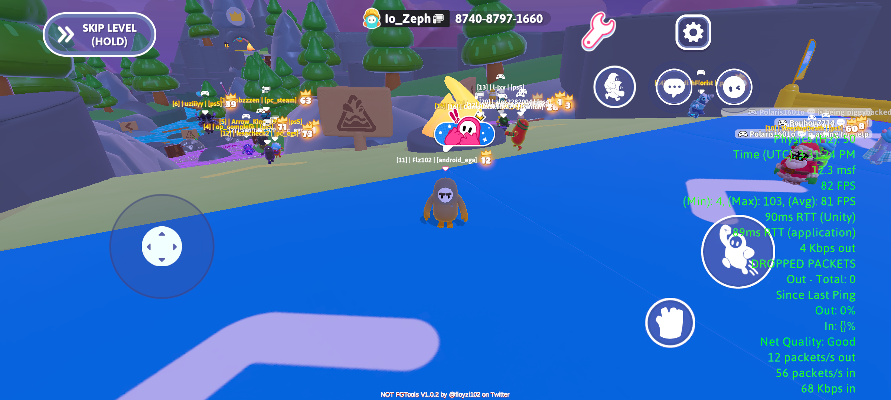
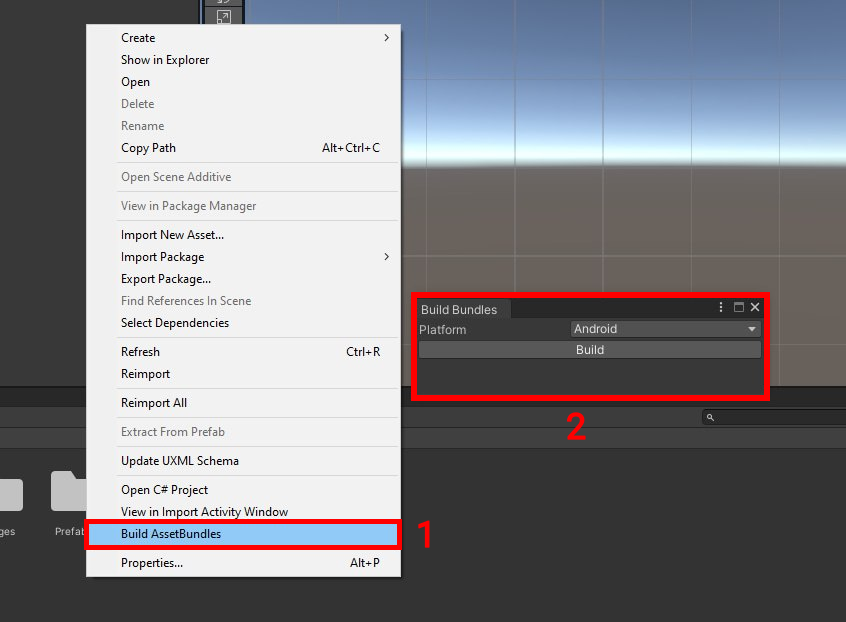

# FGTools Mobile

Mobile version of FGTools

# Features
- Round loader that allows you to load any round in the game in singleplayer
- Ability to set custom FPS limit
- FG Debug (FPS counter, network statistics, etc)
- Unity log tracking
- Some cheats (never included in the release version)

> [!NOTE]
> Work may be unstable, not all devices are supported
> If you don't want to wait for game resources to download, backup the .obb file inside the Android/obb/com.Mediatonic FallGuys_client/ folder, just restore it after installing the APK

# Screenshots

# Building

### Project
- Open it with Visual Studio
- Update the references in the `Lib` folder if needed (to do that use [this version of MelonLoader](https://github.com/LemonLoader/MelonLoader/releases/tag/0.6.5.1) on the desktop version of the game)
- To build with cheats included add `CHEATS` compilation symbol for selected configuration

> [!TIP]
> You can setup ADB to automatically update mod files on device after build

- Download [Platform Tools](https://developer.android.com/tools/releases/platform-tools)
- Put `platform_tools` folder inside the solution folder
- Enable USB debugging in developer settings on your device
- Connect your device

If configured correctly, everytime when you build the project it's files will be automatically updated on device

### UI Bundle
- Download [Unity Hub](https://unity.com/unity-hub)
- Install Unity `2021.3.16f1` with Android Build Tools 
- Open the project and select `Build AssetBundles` in the default context menu (right click in the file inspector)

- Your bundle will be in the `AssetBundles/[SELECTED_PLATFORM]` folder inside the project

# Installing
## Without modifying anything 
- [Download the latest release](https://github.com/floyzi/FGToolsMobile/releases/latest)
- Install it 
- DONE!!!

## With modifying 
- Get Fall Guys APK that is patched via this version of [LemonLoader](https://github.com/LemonLoader/MelonLoader/releases/tag/0.6.5.1) 
- Navigate to `Melonloader/[GAME_PACKAGE_NAME]/Mods`
- Put the `NOT_FGTools` folder from the Assets folder and `NOT FGTools.dll` that you built there
- Launch the game
- Profit

# FAQ
### Can I play online with this?
- Yes!
### Can I use this on Emulator?
- LemonLoader doesn't have official emulator support but you can try it
### Will I get banned for this?
- If you're using a version with cheats, probably. If not then you're safe, there's nothing that can ban you
### My game crashes, what do I do!?
- If it was the first launch, just open it again **and wait around FIVE OR TEN MINUTES sitting on black screen!!**. If the game crashes no matter what then you're out of luck, there is nothing you can do to fix it.
- You can try [**Fall Guys Mod Menu**](https://github.com/repinek/fallguys-frida-modmenu) by [repinek](https://github.com/repinek) if you're looking for similar thing
### Does this thing have cheats?
- Release versions **NEVER** includeds cheats. If you want to get cheats compile it by yourself
### Where is the update?
- I update the mod when I have time and motivation to do so, it's an open source project and all building and usage instructions are listed above, it's not that hard to update it by yourself. 
If you don't have PC then wait, and wait more, nothing else
### FGTools Mobile Download

# Credits
- Made using [LemonLoader](https://github.com/LemonLoader/MelonLoader)
- [repinek](https://github.com/repinek) and Toytyis - playtesting
